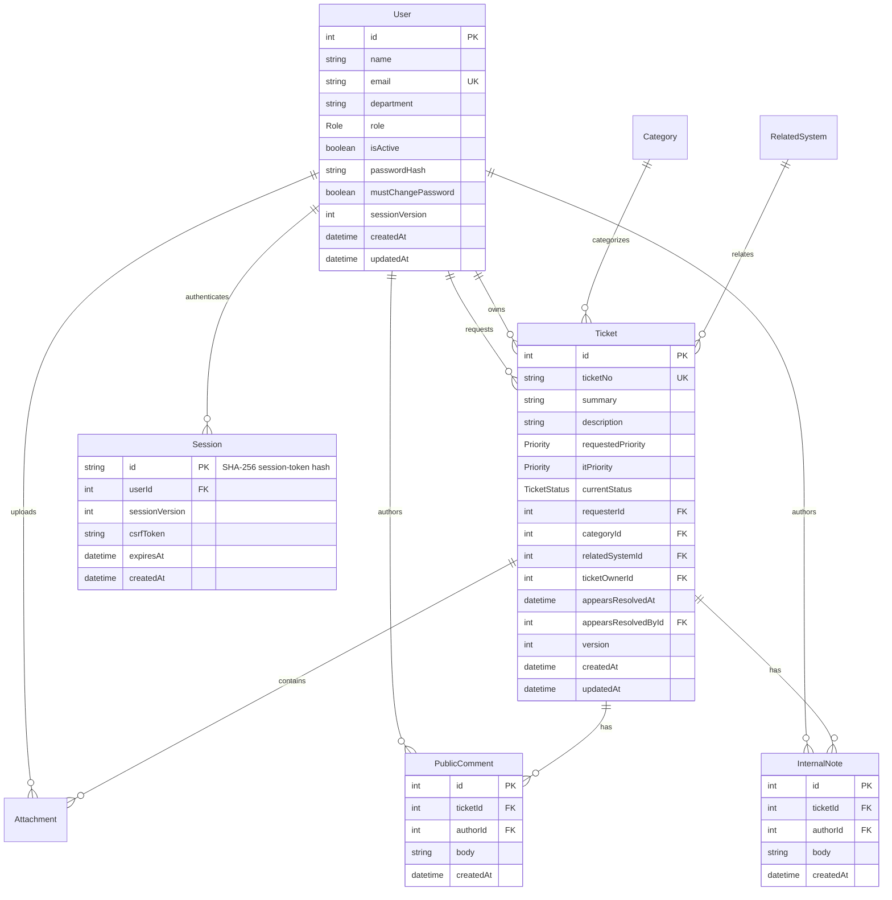

# TokTickIT — Engineering Specification (Lab 3)

**Document Version:** 1.1.0
**Status:** REVISED DRAFT — Contract corrections; implementation gates remain open
**Sprint:** Sprint 3 (Lab 3: Authentication, RBAC, IT Staff Queue & Operations, Comments/Notes, User Administration)
**Target Branch:** `lab3-staging`
**Base:** `main` (`b94642a`)
**Standard Compliance:** CPE 334 Lab 3 Specification Guidelines (§9, 11 Sections)

---

## 1. Sprint Goal

Transition TokTickIT from a single-role development prototype (Lab 2) into a course-scoped, multi-role IT ticketing system. This entails implementing secure authentication (HttpOnly session-based), role-based access control (RBAC) across three distinct roles (`REQUESTER`, `IT_STAFF`, `ADMINISTRATOR`), IT Staff ticket management (queue search/filter/sort/pagination, assignment, IT priority, 8 status transitions), append-only communications (Public Comments & Internal Notes), and administrative user management with strict safety invariants, while preserving Lab 2 business behavior and data while replacing its development identity mechanism.

---

## 2. Stakeholder Request & Background

TokTickIT was successfully piloted as a Requester Ticketing MVP in Lab 2. Stakeholders now require:
1. **Real Authentication & Identity**: Decommission the development identity selector (`X-Requester-Id`) and require secure authentication with mandatory first-time password changes.
2. **IT Staff Workflows**: Empower IT Staff to triage, prioritize, claim, reassign, and progress tickets across an 8-state lifecycle.
3. **Transparent & Safe Communication**: Enable public dialogue between Requesters and IT Staff, while providing confidential internal collaboration notes restricted strictly to IT Staff and Administrators.
4. **User Administration**: Give Administrators the capability to provision users, assign roles, manage active status, and reset passwords with self-deactivation and last-admin protections.

---

## 3. Scope

### 3.1 Included Scope
- **Authentication**: Stateful sessions via secure HttpOnly cookies, Argon2id password hashing, login, logout, current user profile (`/api/auth/me`), CSRF protection, and mandatory initial password change enforcement.
- **Authorization & RBAC**: Strict server-side role and ownership validation across all endpoints; client UI role-based navigation.
- **Requester Regression**: Complete preservation of Ticket Creation, My Tickets, Ticket Detail, and Attachment upload/download/soft-remove on authenticated identity.
- **IT Staff Queue**: Search, multi-filtering (category, priorities, status, assignment), semantic priority sorting, and pagination.
- **IT Staff Operations**: Atomic ticket claim, reassign to active staff/admin, IT Priority updates, permitted 8-state transitions with concurrency versioning (`409 Conflict`).
- **Communication**: Append-only Public Comments (Requester/Staff/Admin) and Internal Notes (Staff/Admin only); Requester "Problem Appears Resolved" indication.
- **User Administration**: Admin user list with search, user creation with temporary credentials, user editing, activation/deactivation safety checks, and credential resets.
- **Design System**: Strict reuse of Zen Green tokens, accessible responsive layouts (Desktop ≥992px, Tablet 768–991px, Mobile <768px), and all meaningful feedback states, including forbidden, not-found, conflict, and safe failure.

### 3.2 Explicitly Excluded (Per Lab 3 Sheet §4.2)
- Self-registration / public signup.
- Email delivery systems, email verification, or password reset via email.
- Multi-factor authentication (MFA), SSO, OAuth, or social login.
- Multiple simultaneous roles per user account.
- Permanent user deletion or purge routes (soft deactivation only).
- Multi-tenant architecture, departmental silos, or organizational hierarchies.
- IT Staff Ticket Creation (Tickets originate exclusively from Requesters).
- Actions Taken / Service Actions logging (deferred to Lab 4).
- Formal SLA engines, escalation rules, and automatic notification dispatchers.
- Dashboards/KPI analytics beyond simple queue counts; production/cloud infrastructure changes.
- Department/profile management, photos, account history, bulk operations, import/export.
- Account unlocking, approval workflows, and advanced recovery/identity management.
- Mandatory admin pagination, multi-column sorting, or multiple simultaneous filters.
Existing department data is retained as read-only legacy metadata; it is not a user-editable field.

---

## 4. Functional Requirements (FR: R01 – R28)

- **R01 (Auth Lifecycle):** Secure login via email and password for active accounts, server-side session invalidation on logout, current authenticated user profile retrieval.
- **R02 (Forced Password Change):** Accounts flagged with `mustChangePassword: true` must be strictly restricted to password change, me, logout, and CSRF endpoints. All business APIs must return `403 Forbidden` (`PASSWORD_CHANGE_REQUIRED`).
- **R03 (Three Distinct Roles):** System supports exactly 3 roles: `REQUESTER`, `IT_STAFF`, `ADMINISTRATOR`. Each user holds exactly one role. All permissions enforced server-side.
- **R04 (Authenticated Identity Replacement):** Replace all temporary Lab 2 requester switching mechanisms with authenticated session identity. Legacy `X-Requester-Id` and supplied `requesterId` never override session identity; they are ignored. A header alone cannot authenticate.
- **R05 (Lab 2 Preservation):** All existing tickets, attachments, ticket numbers (`ticketNo`), and categories remain intact without data loss.
- **R06 (Ticket Ownership & Assignment):** Tickets have 0..1 owners (`ticketOwnerId`). Eligible owners are active IT Staff and Administrators. Claim and reassign actions validate eligibility.
- **R07 (IT Priority Management):** `itPriority` is initialized to match `requestedPriority` at creation. Only IT Staff may update `itPriority`. `requestedPriority` remains immutable.
- **R08 (Eight-State Lifecycle):** Ticket transitions across 8 explicit statuses (`NEW`, `OPEN`, `IN_PROGRESS`, `WAITING_FOR_REQUESTER`, `RESOLVED`, `CLOSED`, `REOPENED`, `CANCELLED`).
- **R09 (Problem Appears Resolved):** Requesters may indicate their problem appears resolved. This records actor and timestamp but does NOT formally close or resolve the ticket.
- **R10 (Append-Only Communications):** Public Comments and Internal Notes are strictly append-only. Editing and deleting entries are forbidden. Author and timestamp are assigned exclusively by the server.
- **R11 (Confidentiality Scoping):** Internal Notes are restricted strictly to IT Staff and Administrators. Requesters cannot view, create, or detect the presence of Internal Notes.
- **R12 (Non-Destructive Migration):** Schema additions must be forward migrations. Legacy tables, IDs, and existing `itPriority` values must be preserved without data loss.
- **R13 (Idempotent Seed):** Seeding must be idempotent, providing 4 active + 1 inactive Requesters, 3 active + 1 inactive Staff, and ≥1 active Admin, plus reference data.
- **R14 (Realistic Fixtures):** Seed tickets distributed across all 8 statuses, 3 priorities, assigned/unassigned states, and accompanied by realistic comments and notes.
- **R15 (RESTful Consistency):** Strict adherence to REST conventions, JSON error envelopes, and exact HTTP status codes (400, 401, 403, 404, 405, 409, 410, 429, 500).
- **R16 (Queue Capabilities):** IT Staff queue supports text search, multi-filter combinations, semantic priority sorting, and pagination with consistent totals.
- **R17 (Design Consistency):** Reusable Zen Green theme tokens, role-based navigation bar, user identity pill, status badges, and responsive form controls.
- **R18 (Staff Ticket Detail):** Comprehensive staff detail interface showing read-only ticket classification, operational controls, and communication threads.
- **R19 (Admin User Directory):** Clean tabular view of users with search by name/email, role indicator, active status badge, and edit trigger.
- **R20 (User Provisioning & Credential Reset):** Administrators can provision new accounts with temporary credentials and reset initial passwords for existing accounts.
- **R21 (Invariants & Safety Guards):** Unique canonical email validation, single role enforcement, prevention of self-deactivation, and prevention of demoting/deactivating the last active Admin.
- **R22 (Screen Feedback & Viewports):** Distinct feedback states (loading, empty, no-results, validation, submitting, success, failure) verified on Desktop (1280px), Tablet (768px), and Mobile (375px).
- **R23 (Specification Standards):** Formal engineering contract with 11 numbered sections.
- **R24 (Test Traceability):** 100% of Acceptance Criteria (AC-01 through AC-56) mapped to planned and executed tests.
- **R25 (Git Workflow):** Issue-driven branching (`feature/*` -> `lab3-staging` -> `main`), PR peer reviews, and verified merge records.
- **R26 (Repository Standards):** Clean file tree, designated test directories, and screenshot directories.
- **R27 (AI Transparency):** Accurate `ai-use.md` with prompt log and authentic human reflection.
- **R28 (Final Submission Package):** Single PDF submission structured precisely into Answer Part 1 through Answer Part 9.

---

## 5. Business Rules (BR)

### 5.1 Authentication & Security Rules
- **BR-01 (Session Token & Cookie):** Session IDs are CSPRNG-generated strings (≥32 bytes), stored hashed in PostgreSQL, and transmitted via an `HttpOnly`, `SameSite=Lax`, `Path=/` cookie. Absolute session lifetime is 8 hours.
- **BR-02 (Mandatory Password Change):** An active session where `mustChangePassword === true` is barred from all business endpoints. Attempted access returns `403 Forbidden` with error code `PASSWORD_CHANGE_REQUIRED`.
- **BR-03 (Password Complexity & Policy):** Passwords must be 12–128 Unicode characters. Whitespace is permitted and not trimmed. New password must differ from current password. Confirmation must match.
- **BR-04 (Brute Force Protection):** Max 5 failed login attempts per normalized email / IP within 15 minutes triggers `429 Too Many Requests` with a `Retry-After` header. No permanent account lockouts.
- **BR-05 (Generic Credential Errors):** Invalid password, non-existent email, or inactive account returns a uniform `401 Unauthorized` message to prevent account enumeration.

### 5.2 Authorization & Role Rules
- **BR-06 (Single Role Invariant):** Every user has exactly one assigned role (`REQUESTER`, `IT_STAFF`, or `ADMINISTRATOR`).
- **BR-07 (Requester Scoping):** Requesters can only access and view tickets they created (`requesterId === currentUser.id`). Attempting to read or mutate another requester's ticket returns `403 Forbidden` without revealing metadata.
- **BR-08 (Internal Note Confidentiality):** Internal Notes are strictly inaccessible to Requesters. Any requester request to `/api/tickets/:id/internal-notes` returns `403 Forbidden` before querying the database. Responses must never leak counts or existence.
- **BR-09 (Operational Field Immutability for Requesters):** Requesters cannot modify `ticketOwnerId`, `itPriority`, or `currentStatus`.

### 5.2.1 Authorization Matrix (Normative)

All business access requires an active session and completed password change. Denial is
403; missing/expired/revoked session is 401. Requester resource ownership denial stays 403.

| Operation | Requester | IT Staff | Administrator |
|---|---|---|---|
| Me, logout, own password change, CSRF bootstrap | Own session, including forced-change session | Same | Same |
| Create/list own tickets; requester detail | Own only | Denied | Denied |
| Staff Queue/detail and eligible-owner list | Denied | Allowed | Denied |
| Admin read-only ticket detail | Denied | Denied | Allowed |
| Claim/reassign/IT Priority/status | Denied | Allowed | Denied |
| Eligible primary Ticket Owner | No | Active only | Active only |
| Read Public Comments | Own ticket | All tickets | All tickets |
| Create Public Comment | Own ticket | All tickets | Denied |
| Read Internal Notes | Denied before resource lookup | Allowed | Allowed |
| Create Internal Note | Denied | Allowed | Denied |
| Download active attachment | Own ticket | All tickets | All tickets |
| Upload/soft-remove attachment | Own ticket | Denied | Denied |
| Problem Appears Resolved | Own ticket, permitted statuses | Denied | Denied |
| List/create/edit users, reset initial password | Denied | Denied | Allowed with safety guards |
| Categories and Related Systems reference reads | Allowed | Allowed | Allowed |

Admin ticket reads have their own `/admin/tickets/:id` UI and API route, reached by an
explicit permitted URL, without granting Queue or Staff mutation access. This implements
the handout's separation of responsibilities while preserving Admin comment/note visibility.

### 5.3 Ticket Lifecycle & Workflow Rules
- **BR-10 (Ticket Creation Defaults):** Every newly created ticket begins in status `NEW`, with `ticketOwnerId: null`, and `itPriority: requestedPriority`.
- **BR-11 (Eligible Owners):** Only active users with role `IT_STAFF` or `ADMINISTRATOR` may be designated as `ticketOwnerId`.
- **BR-12 (Claim Semantics):** A ticket may only be claimed if `ticketOwnerId === null`. Claiming assigns the ticket to the claiming IT Staff member. Claiming an unassigned ticket does not change its status automatically.
- **BR-13 (Reassignment):** Reassigning an assigned ticket requires an explicit reassign action specifying the new eligible owner.
- **BR-14 (Eight-State Permitted Transitions):**
  - `NEW` $\rightarrow$ `OPEN`, `CANCELLED`
  - `OPEN` $\rightarrow$ `IN_PROGRESS`, `WAITING_FOR_REQUESTER`, `CANCELLED`
  - `IN_PROGRESS` $\rightarrow$ `WAITING_FOR_REQUESTER`, `RESOLVED`, `CANCELLED`
  - `WAITING_FOR_REQUESTER` $\rightarrow$ `IN_PROGRESS`, `RESOLVED`, `CANCELLED`
  - `RESOLVED` $\rightarrow$ `CLOSED`, `REOPENED`
  - `CLOSED` $\rightarrow$ `REOPENED`
  - `REOPENED` $\rightarrow$ `OPEN`, `IN_PROGRESS`, `CANCELLED`
  - `CANCELLED` $\rightarrow$ *Terminal (No further transitions allowed)*
- **BR-15 (Transition Ownership Preconditions):** Transitioning to `OPEN`, `IN_PROGRESS`, or `WAITING_FOR_REQUESTER` requires an assigned active IT Staff/Admin owner. RESOLVED also requires an eligible owner. Reopening clears both appears-resolved fields; all other transitions preserve them.
- **BR-16 (Optimistic Concurrency):** Status, owner, and priority mutations require client submission of `expectedVersion` (positive integer matching `Ticket.version`). Stale writes return `409 Conflict`.
- **BR-17 (Problem Appears Resolved Semantics):** Requesters may invoke this on their own tickets when status is `OPEN`, `IN_PROGRESS`, `WAITING_FOR_REQUESTER`, or `REOPENED`. This sets `appearsResolvedAt` and `appearsResolvedById`. Status remains unchanged. Multiple invocations are idempotent no-ops.

### 5.4 Administrative Safety Rules
- **BR-18 (Canonical Email):** Email addresses are trimmed and stored lowercase. Uniqueness is enforced both in application validation and PostgreSQL unique constraint.
- **BR-19 (Self-Deactivation Protection):** An Administrator cannot deactivate their own user account.
- **BR-20 (Last Active Admin Protection):** An Administrator cannot be deactivated or demoted if they are the sole remaining active Administrator in the system.
- **BR-21 (Owner Deactivation Cascade):** Deactivating an owner or changing their role to REQUESTER atomically unassigns affected tickets, increments their versions, and preserves status/requester/author history. The response includes the affected count. Reassign an eligible owner before transitions that require one.

---

## 6. UI Summary & Screen Specifications

### 6.1 Authentication Screens
1. **Login Screen (`/login`):** Email and password inputs, accessible show/hide password toggle, clear validation feedback, busy indicator on submit, safe generic error banner.
2. **Change Password Screen (`/change-password`):** Required for initial login when `mustChangePassword === true`. Fields: Current Password, New Password, Confirm New Password. Inline policy guidance.

### 6.2 IT Staff Screens
3. **IT Staff Ticket Queue (`/staff/queue`):**
   - Header with search input (ticket number, summary) and debounce protection.
   - Filter bar: Category dropdown, Requested Priority, IT Priority, Status, and Owner filter (`All`, `Unassigned`, `Me`, or specific staff).
   - Sortable columns: Priority (semantic order), Status, Updated Date, Ticket No.
   - Desktop view: Responsive table with badges and Action button to open detail.
   - Tablet & Mobile view: Clean stacked Zen cards avoiding horizontal page overflow.
   - Pagination controls: Page size selector (10, 20, 50), Previous/Next, direct page links.
4. **Staff Ticket Detail (`/staff/tickets/:id`):**
   - Left / Top: Ticket summary, description, requester metadata, category, related system, requested priority.
   - Operational Panel:
     - Owner section: Current owner, Claim button (if unassigned), Reassign dropdown.
     - IT Priority section: Dropdown with immediate save and confirmation.
     - Status section: Dropdown restricted to valid next transitions with modal confirmation for terminal/reopen states.
     - Appears Resolved alert banner (if flagged by requester).
   - Communication Threads: Two tabbed panels:
     - **Public Comments Tab**: Shared thread visible to Requester.
     - **Internal Notes Tab**: Yellow-tinted confidential thread restricted to Staff/Admin.
   - Attachments section: Read existing metadata and download active files. Staff/Admin cannot upload or soft-remove; only the owning Requester can.

### 6.3 Administrator Screen
5. **User Management Screen (`/admin/users`):**
   - Search bar by user name or email.
   - "Add User" button triggering creation modal (Name, Email, Role, Active state, Initial Password).
   - User table: Name, Email, Role badge, Active status badge, and Actions (`Edit`, `Reset Password`).
   - Edit Modal: Name, Email, Role, Active toggle with confirmation dialog.
   - Reset Password Modal: Allows setting a new temporary password, forcing `mustChangePassword: true` on next login.

### 6.4 Shell & Requester Detail Regression
- **Authenticated AppShell:** Zen Green header with TokTickIT brand, current user name, role badge, role-appropriate navigation links, and dropdown menu with `Change Password` and `Logout`.
- **Requester Ticket Detail (`/tickets/:id`):** Updated to include Public Comments thread and "Problem Appears Resolved" action button while completely hiding internal notes.

---

## 7. Data Changes & Schema Models

The database schema preserves existing Lab 2 tables and columns, applying additive migrations only.

### 7.1 Entity Relationship Diagram

### 7.2 Migration, Indexes, Credentials and Seed Plan

1. Map Prisma `User` to the existing physical `RequesterUser` table with `@@map`.
   Preserve requester IDs, `Attachment.uploadedByRequesterId`, Ticket/Attachment IDs,
   reference rows, filenames, soft-removal metadata, and physical bytes. Preserve the
   required legacy department column with an empty-string default for newly created users;
   API clients cannot create/edit this field.
2. Add role, nullable passwordHash for unprovisioned accounts, mustChangePassword, and
   sessionVersion (integer, initially 1). Add a Session table with hashed token primary key,
   user FK, captured sessionVersion, CSRF token, createdAt and expiresAt. No raw session
   token is persisted. User role/activation changes and resets revoke all sessions atomically.
3. Preserve existing enum values and add the five missing statuses. Reuse itPriority and
   ticketOwnerId. Add version (default 1), nullable appearsResolvedAt/appearsResolvedById
   with a User FK, and separate PublicComment/InternalNote author/ticket relations.
   Preserve valid IT Priority values; only backfill missing values from Requested Priority.
4. Keep existing indexes; add Session(userId), Session(expiresAt), comment/note(ticketId,
   createdAt, id), comment/note(authorId), Ticket(ticketOwnerId, updatedAt),
   Ticket(currentStatus, updatedAt), and Ticket(appearsResolvedById). Canonical email
   uniqueness is enforced in PostgreSQL. Preflight normalized-email collisions and invalid
   owner references; report conflicts instead of merging people or deleting data.
5. On a disposable copy: capture before/after counts, IDs, FK mappings, statuses, priority
   values, attachment metadata and SHA-256 of files. Apply expand/backfill/validate/constrain
   forward migrations; never edit applied migrations. Test a fresh migration chain separately.
   Verify sequences accept new records without collision. Capture and verify backup restoration
   on a copy; a Prisma model rename requires coordinated generated-client/caller updates.
6. A local provisioning helper accepts per-user temporary secrets at runtime, hashes them,
   sets mustChangePassword, and never prints or commits plaintext secrets. No hash means
   login is denied. Provide local-only fictional seed credentials in setup documentation;
   never assign a universal committed password to migrated real accounts.
7. Seed counts/data follow AC-18. Use stable unique seed keys (including comments/notes),
   initialize credentials only when missing, and run twice to prove no duplication, no
   changed-password reset, and no overwrite of existing valid rows. Snapshot the test fixture
   at run start; historical counts in baseline.md are not hardcoded completion assertions.

---

## 8. REST API Contract Overview

All protected endpoints enforce session authentication and role permissions; login and the idempotent no-session logout exception follow api-spec.md §2.6. Complete details and schemas are specified in `api-spec.md`.

| Method | Endpoint Path | Description | Access Role |
|---|---|---|---|
| `POST` | `/api/auth/login` | Authenticate credentials; set session cookie | Public |
| `GET` | `/api/auth/me` | Retrieve authenticated user profile | Any Active Session |
| `POST` | `/api/auth/logout` | Revoke session and clear cookie | Any Active Session |
| `POST` | `/api/auth/change-password` | Update user password; clear forced change flag | Any Active Session |
| `GET` | `/api/auth/csrf` | Retrieve CSRF validation token | Any Active Session |
| `GET` | `/api/tickets` | List own tickets (Paginated, filtered) | Requester |
| `POST` | `/api/tickets` | Create ticket (Status `NEW`, unassigned) | Requester |
| `GET` | `/api/tickets/:id` | Get own ticket detail | Requester |
| `POST` | `/api/tickets/:id/appears-resolved`| Flag problem appears resolved | Requester (Owner) |
| `GET` | `/api/tickets/:id/public-comments` | List public comments on ticket | Requester / Staff / Admin |
| `POST` | `/api/tickets/:id/public-comments`| Post public comment | Requester / Staff |
| `GET` | `/api/tickets/:id/internal-notes` | List internal notes | IT Staff / Admin |
| `POST` | `/api/tickets/:id/internal-notes` | Post internal note | IT Staff |
| `GET` | `/api/staff/tickets` | IT Staff Queue query (search, filter, sort, page)| IT Staff |
| `GET` | `/api/admin/tickets/:id` | Read-only ticket detail | Administrator |
| `GET` | `/api/staff/tickets/:id` | IT Staff Ticket Detail with operational data | IT Staff |
| `POST` | `/api/staff/tickets/:id/claim` | Claim unassigned ticket | IT Staff |
| `PATCH`| `/api/staff/tickets/:id/owner` | Reassign ticket owner | IT Staff |
| `PATCH`| `/api/staff/tickets/:id/it-priority`| Update IT priority | IT Staff |
| `PATCH`| `/api/staff/tickets/:id/status` | Advance ticket status | IT Staff |
| `GET` | `/api/staff/ticket-owners` | List active IT Staff & Admin for assignment | IT Staff |
| `GET` | `/api/admin/users` | List users with search | Administrator |
| `POST` | `/api/admin/users` | Provision new user account | Administrator |
| `PATCH`| `/api/admin/users/:id` | Edit user profile, role, or active status | Administrator |
| `POST` | `/api/admin/users/:id/initial-password` | Reset temporary user password | Administrator |

---

## 9. Acceptance Criteria (AC: AC-01 to AC-56)

1. **AC-01:** Active valid user logs in successfully, receiving HTTP-only session cookie and safe user profile.
2. **AC-02:** User with `mustChangePassword === true` is blocked from business APIs and forced to change password.
3. **AC-03:** Submitting legacy `X-Requester-Id` header is ignored; server derives requester identity strictly from session.
4. **AC-04:** Requester requesting Internal Notes endpoint receives `403 Forbidden` with zero note content or existence leak.
5. **AC-05:** Invalid email, wrong password, or inactive account returns uniform `401 Unauthorized`.
6. **AC-06:** Password policy enforced (12–128 chars, whitespace preserved, confirmation check, new differs from old).
7. **AC-07:** `/api/auth/me` returns current user; expired or missing session returns `401 Unauthorized`.
8. **AC-08:** Logout invalidates server session; subsequent requests with revoked cookie return `401`.
9. **AC-09:** Exceeding 5 failed login attempts in 15 minutes triggers `429 Too Many Requests` with `Retry-After`.
10. **AC-10:** CSRF protection verifies valid origin / session token for all state-changing mutations.
11. **AC-11:** Inactive accounts or changed roles immediately invalidate existing sessions upon next request.
12. **AC-12:** Login and Change Password screens display proper validation, busy state, safe errors, and success flow.
13. **AC-13:** Role-based navigation displays correct links and user badge; development selector completely absent.
14. **AC-14:** Existing tickets, attachments, categories, and requester mappings remain intact post-migration.
15. **AC-15:** Forward database migration applies cleanly on fresh and populated test databases without data loss.
16. **AC-16:** Idempotent seed script runs repeatedly without duplicating records or overwriting changed passwords.
17. **AC-17:** Seeded/migrated Requesters have valid provisioned credentials and initial password change flag.
18. **AC-18:** Seed includes at least 4 active and 1 inactive Requester, 3 active and 1 inactive Staff, and 1 active Admin; at least 24 fictional tickets span all 8 statuses, all priorities and assigned/unassigned ownership, with sample comments and notes.
19. **AC-19:** Requester ticket creation, listing, detail, and ticket number formatting retain full Lab 2 behavior.
20. **AC-20:** Legacy attachment upload, list, download, and soft-remove function with full ownership protection.
21. **AC-21:** Accessing foreign or removed attachments returns `403` / `410` with zero file bytes; genuinely missing resources return `404`. Ownership is checked before removed-state disclosure.
22. **AC-22:** Logging out and logging in as another requester completely isolates ticket cache and state.
23. **AC-23:** IT Staff Queue accessible to IT Staff; denied (`403`) to Requesters and non-permitted roles.
24. **AC-24:** Queue search by ticket number and summary operates case-insensitively with combined filters.
25. **AC-25:** Semantic priority sorting orders tickets by `HIGH` > `MEDIUM` > `LOW` rather than alphabetical order.
26. **AC-26:** Queue pagination handles bounds, total counts, page sizes (10/20/50), and page resets on filter change.
27. **AC-27:** Queue renders distinct loading skeleton, empty queue, no-results state, and error retry state.
28. **AC-28:** Staff Detail shows all read-only ticket fields and exposes operational panels only to permitted roles.
29. **AC-29:** Staff can claim an unassigned ticket and assign/reassign to an active Staff/Admin. Every already-owned claim returns 409. Null, inactive, nonexistent and Requester owners are rejected.
30. **AC-30:** Concurrent claim or stale status update returns `409 Conflict` prompting the user to refresh.
31. **AC-31:** IT Priority updates independently from Requested Priority; Requested Priority remains immutable.
32. **AC-32:** Status transitions strictly adhere to permitted 8-status matrix; illegal transitions rejected with `400`.
33. **AC-33:** Requester cannot set status to `RESOLVED` or `CLOSED` or mutate operational fields.
34. **AC-34:** Requester "Problem Appears Resolved" records timestamp and actor without changing formal status.
35. **AC-35:** Public comments are readable by own Requester, Staff, and Admin; creatable by Requester and Staff.
36. **AC-36:** Internal notes are readable by IT Staff and Admin, creatable only by IT Staff, and completely hidden from Requester.
37. **AC-37:** Comments and notes are strictly append-only; `PUT`, `PATCH`, and `DELETE` requests are rejected with `405`.
38. **AC-38:** Comment content trimmed, validated (1–2,000 chars), and rendered safely without HTML injection.
39. **AC-39:** IT Staff can complete end-to-end flow: triage queue $\rightarrow$ claim $\rightarrow$ prioritize $\rightarrow$ comment $\rightarrow$ resolve.
40. **AC-40:** Admin User Management lists Name, Email, Role, Status and Edit, with name/email search and a single optional role filter.
41. **AC-41:** Admin can provision new user with valid single role, active state, and initial password.
42. **AC-42:** Duplicate email submission (case-insensitive and trimmed) returns `409 Conflict`.
43. **AC-43:** Admin can edit user name, email, role, and active status without modifying credential fields.
44. **AC-44:** Administrator self-deactivation is strictly blocked by application logic and API response `400`.
45. **AC-45:** Deactivation or demotion of the last remaining active Administrator is blocked with `400`.
46. **AC-46:** Deactivating an owner or changing them to REQUESTER unassigns their tickets atomically, increments versions, preserves statuses and displays the affected count.
47. **AC-47:** Admin password reset forces `mustChangePassword === true` and revokes user sessions immediately.
48. **AC-48:** Non-admin attempting to access user management APIs or screens receives `403 Forbidden`.
49. **AC-49:** Admin screens handle loading, validation errors, busy states, and success confirmations.
50. **AC-50:** Desktop (1280px), Tablet (768px), and Mobile (375px) viewports display no clipped labels or horizontal scroll.
51. **AC-51:** Strict reuse of Zen Green palette, typography, status badges, and clear read-only vs editable styling.
52. **AC-52:** Keyboard accessibility, associated `<label>` elements, focus rings, and touch targets (≥44px) verified.
53. **AC-53:** Safe error handling: `404`, `409`, and `500` responses never leak stack traces, database secrets, or foreign data.
54. **AC-54:** Complete engineering documentation (`specification.md`, `api-spec.md`, `ui-spec.md`, `tests.md`).
55. **AC-55:** Specification and Test Plan exist and are reviewed before implementation PRs are merged.
56. **AC-56:** Final main test suites pass with recorded commit SHA; single submission PDF (Parts 1–9) verified.

---

## 10. Definition of Done (DoD)

P00–P02 have their own documentary/harness gates in PHASES.md. A product feature is marked **Done** only when all of the following conditions are met:
1. Every corresponding Acceptance Criterion has at least one automated or formal verification test passing.
2. Feature implementation follows TDD: write the planned test, confirm the expected Red, implement, then Green. Documentation-only review uses traceability/diff checks and does not invent a feature Red/Green result.
3. No tests are skipped (`.skip`), disabled, commented out, or reduced in assertion strength.
4. Server, client, and E2E suites pass with zero regressions against baseline.
5. All code adheres to TypeScript strict mode with zero build errors.
6. Responsive layouts verified across Desktop (1280px), Tablet (768px), and Mobile (375px) without clipping or horizontal overflow.
7. Feature branch merged into `lab3-staging` via approved GitHub Pull Request with documented peer review.

---

## 11. Assumptions & Technical Decisions

1. **Session Store Strategy:** Stateful HttpOnly cookies backed by PostgreSQL session records are selected over stateless JWTs to enable instantaneous revocation during logout, password reset, or account deactivation.
2. **Password Cryptography:** Argon2id is selected; the hashing profile is fixed in api-spec.md §2.6; the package/version requires a dependency patch before P04. No dependency installation is authorized by this document.
3. **Optimistic Locking:** Concurrency conflicts on ticket mutations resolved via version numbers, returning `409 Conflict` with refetch instructions.
4. **Preserved Schema Conventions:** Existing column name `ticketNo` is retained (avoiding disruptive renaming to `ticketNumber`). `ticketOwnerId` and `itPriority` are reused.
5. **Test Isolation Guard:** All database/API/E2E runs must execute against an isolated disposable database (`toktickit_test`) and isolated uploads folder (`test-uploads`) to guarantee zero pollution of shared data.

6. **Legacy compatibility:** Keep Lab 2 requester query names, pagination, ticket/attachment
   DTOs and error bodies. Only session authentication, expanded status allowlist, current
   operational values, and explicitly additive detail fields change. Refer to api-spec.md §3.
7. **Workflow decisions:** Claiming any assigned ticket is 409 (including own claim); manual
   unassign is excluded and ownerId null is 400. Eligible owner is required for OPEN,
   IN_PROGRESS, WAITING_FOR_REQUESTER and RESOLVED transitions. Only CANCELLED is terminal.
8. **Business-rule numbering:** BR IDs here are local contract IDs, not the sheet's example
   numbering. Mandatory sheet BR-01 maps to R01/BR-05/AC-01/AC-05; sheet BR-02 to BR-02;
   sheet BR-03 to R04/BR-07/AC-03; sheet BR-04 to §5.2.1/BR-08/AC-35/AC-36;
   sheet BR-05 to BR-09/BR-17/AC-33/AC-34.
9. **Release DoD:** The feature checklist in §10 is necessary but not sufficient for product
   completion. Final-main SHA and complete passing output, reviewer identity/comments/
   responses/approval/merge records, all Issues Done, README/.gitignore, actual test paths,
   screenshots and completed visual checklist, ai-use.md with 6–10 real prompts and the
   student's reflection, and one verified PDF Parts 1–9 are required by AC-54–AC-56.
